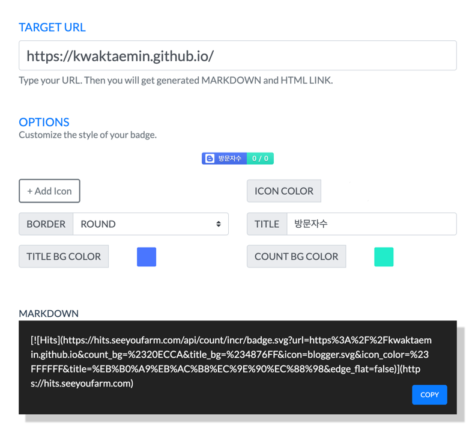

요즘엔 notion api를 이용하여 블로그도 만들고 그렇지만, 나는 github에 잔디를 심는게 기분이 좋아 이 블로그를 고집하려한다.

- 사이트 소개가 너무 없다.
- 거무잡잡하고 이상하다 
- 일단 글씨체를 좀 비율이 좀 이상하다.

### 네이게이션 추가하기 
~~~yaml
main:
  - title: "개발 일기"
    url: https://mmistakes.github.io/minimal-mistakes/docs/quick-start-guide/
    children:
      - title: "Child Link 1"
        url: /child-1-page-url/
      - title: "Child Link 2"
        url: /child-2-page-url/
      - title: "Child Link 3"
        url: /child-3-page-url/
  - title: "niKe"
    url: https://mmistakes.github.io/minimal-mistakes/about/
~~~

### site author 설정
- 블로그 사이트 소개
- 블로그 소개가 너무 되어있지 않으니 사진도 추가하고 설명도 추가해보자
- 개발자들은 트위터도 많이 하는 것 같은데 이제 트위터 계정도 만들고 시도해봐야겠다.'

~~~yaml
author:
  name             : "niKe"
  avatar           : "/assets/images/profile_nike.jpeg"
  bio              : "Victorie de Samothrace"
  location         : "Korea"
  email            : "taminging@kakao.com"
  links:
    - label: "Email"
      icon: "fas fa-fw fa-envelope-square"
      url: "taminging@kakao.com"
    - label: "Website"
      icon: "fas fa-fw fa-link"
      url: "https://kwaktaemin.github.io"
    - label: "Twitter"
      icon: "fab fa-fw fa-twitter-square"
      # url: "https://twitter.com/"
    - label: "Facebook"
      icon: "fab fa-fw fa-facebook-square"
      # url: "https://facebook.com/"
    - label: "GitHub"
      icon: "fab fa-fw fa-github"
      url: "https://github.com/KwakTaeMin"
    - label: "Instagram"
      icon: "fab fa-fw fa-instagram"
      url: "https://www.instagram.com/tminging/"
~~~

### 폰트 사이즈 수정하기 

- /_sass/minimal-mistaks/\_reset.scss 파일 에서 폰트 사이즈를 줄여봅니다.

~~~sass
html {
  /* apply a natural box layout model to all elements */
  box-sizing: border-box;
  background-color: $background-color;
  font-size: 14px;

  @include breakpoint($medium) {
    font-size: 14px;
  }

  @include breakpoint($large) {
    font-size: 16px;
  }

  @include breakpoint($x-large) {
    font-size: 18px;
  }

  -webkit-text-size-adjust: 100%;
  -ms-text-size-adjust: 100%;
}
~~~

### 그래도 뭔가 부족한 것 같다! 

- 댓글 기능이 추가가 필요한 것 같아요
- 방문자 수에 대해 알고 싶어요 
- 게시글의 작성일 정보가 보이면 좋겠습니다.

### 작성일 추가 방법
- _config.yml 파일에서 show_date: ture 를 추가하고 read_time: false 하자!

~~~yaml
# Defaults
defaults:
  # _posts
  - scope:
      path: ""
      type: posts
    values:
      layout: single
      author_profile: true
      read_time: false
      show_date: ture
      comments: true
      share: true
      related: true
~~~

### 방문자 수 추가 방법
- [hits](https://hits.seeyoufarm.com/) 사이트를 이용한다.
- 
- hits에서 제공해준 html link를 복사해둔 후 이제 github.io에 적용해보자 

