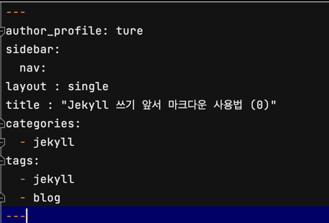
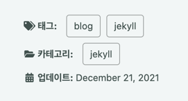

### 카테고리 및 태그 추가 방법

- 아 근데 드럽게 안된다. 방법이 너무 다양해서 가장 간단한 방법으로 하려한다.
- 일단 _posts 폴더 아래의 첫 게시글에 YFM 설정에 카테고리와 태그를 추가해본다.
   


***

- 오 그렇게 추가해 보니 바로 이렇게 게시글 밑에 생겼다.
- 홍냐냐 그치만 누르게 되면 404 에러가 뜬다! Not Found
   



- 흠 근데 나는 이걸 원한게 아니다..
- 왼쪽의 메뉴를 추가하고 싶었다. 네이버 블로그 처럼 왼쪽에 보여지고 싶었다.

*** 

### 사이드 메뉴 

- [램프바바 사이드바 메뉴설정](https://apit.dev/jekyll/minimal-mistakes-side-bar/) 이런 블로그를 참조하게 된다.
- 나는 jekyll 메뉴가 필요하니까 일단 추가해본다. 
- `_data/navigation.yml` 파일
~~~yaml
docs:
  - title: ETC
    children:
      - title: "Jekyll"
        url: jekyll/
        category: "jekyll"

~~~

### 메뉴에 포스트 수 표시 방법

- `_include/nav_list` 파일 

- 해당 부분의 before
~~~ruby

<li><a href="{{ child.url | relative_url }}" class="active">{{ child.title }}</a></li>
{$ endfor %}
~~~

- after 이렇게 변경하면 포스트 수가 생긴다고 한다
~~~ruby


  <li><a href="{{ child.url | relative_url }}" class="active">{{ child.title }} ({{ category.size }})</a></li>

~~~

### 카테고리 페이지 만들기

`_includes` 폴더 밑에 `custom-archive-single.html` 파일을 추가한다.
```html

  {{ post.header.teaser }}

  



  

  


<div class="{{ include.type | default: 'list' }}__item">
  <article class="archive__item" itemscope itemtype="https://schema.org/CreativeWork">
    <div>
      <span>
        <a href="{{ post.url }}">{{post.title}}</a>
      </span>
      <small> 
        <i class="fas fa-fw fa-calendar-alt" aria-hidden="true"> </i>{{ post.date | date: " %Y.%m.%d" }}
        
          
        
      </small>
    </div>
  </article>
</div>
```

### 포스팅 하기

- 포스팅 파일의 헤더부분에 카테고리를 추가한다.
```ruby
---
layout: single
title:  "사이드바 메뉴 설정"
folder: "jekyll"
categories:
  - jekyll
tags: [blog, jekyll]

author_profile: true
sidebar:
  nav: "docs"

toc: true
toc_label: "목록"
toc_icon: "bars"
toc_sticky: true

date: 2021-07-30
---