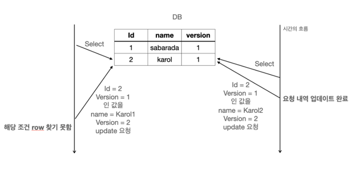

## DB 충돌 상황을 개선할 수 있는 방법
- 테이블의 row에 접근 시 Lock을 걸고 다른 Lock이 걸려 있지 않을 경우에만 수정을 가능하게 할 수 있다.
- 수정할 때 내가 이 값을 수정했다고 명시하여 다른 사람이 동일한 조건으로 값을 수정할 수 없게 하는 것

## 비관적 락 (Pessimistic Lock)

비관적 락이란 트랜잭션이 시작될 때 Shared Lock 또는 Exclusive Lock을 걸고 시작하는 방법이다.
즉, Shared Lock을 걸게 되면 write를 하기위해서는 Exclusive Lock을 얻어야하는데 Shared Lock이 다른 트랜잭션에 의해서 
걸려 있으면 해당 Lock을 얻지 못해서 업데이트를 할 수 없다. 
수정하을 하기 위해서는 해당 트랜잭션을 제외한 모든 트랜잭션이 종료(commit) 되어야한다.  
비관적 락은 Repeatable Read 또는 Serializable 정도의 격리성 수준을 제공한다.


위의 도식도를 보면서 비관적 락에 대해 이해해보도록한다.

1. Transaction 1에서 table의 Id 2번을 조회
2. Transaction 2에서 table의 Id 2번을 조회
3. Transaction 2에서 table의 Id 2번의 name을 Karol2로 변경 요청
   - 하지만 Transaction 1 에서 이미 Shared Lock을 잡고 있기에 Blocking
4. Transaction 1에서 이미 트랜잭션 해제(commit)
5. Blocking 되어있던 Transaction 2의 update 요청 정상 처리

Transaction을 이용하여 충돌을 예방하는 것이 비관적 락이다.

## 낙관적 락 (Optimistic Lock)

낙관적 락은 DB 충돌 상황을 개션할 수 있는 방법 중 2번째 수정할 때 내가 먼저 이 값을 수정했다고 명시하여 
다른 사람이 동일한 조건으로 값을 수정할 수 없게 하는 것 입니다.. 그런데 잘 보면 이 특징은 DB에서 제공해주는 
특징을 이용하는 것이 아닌 Application Level에서 잡아주는 Lock 입니다.



1. A가 Table의 ID 2번을 읽음 (name = Karol, version = 1)
2. B가 Table의 ID 2번을 읽음 (name = Karol, version = 1)
3. B가 Table의 ID 2번, version 1인 row의 값 갱신 (name = Karol2, version = 2) 성공
4. A가 Table의 ID 2번, version 1인 row의 값 갱신 (name = Karol1, version = 2) 실패
   - ID 2번은 이미 version이 2로 업데이트 되었기 때문에 A는 해당 row를 갱신하지 못한다.

위 flow를 통해서 같은 row에 대해서 각기 다른 2개의 수정요청이 있었지만 1개가 업데이트 됨에 따라 version이 변경되었기
때문에 뒤의 수정 요청은 반영되지 않게 되었다. 이렇게 낙관적 락(optimistic lock)은 version과 같은 별도의 컬럼을 추가하여
충돌적인 업데이트를 막는다. version 뿐만 아니라 hashcode 또는 timestamp를 이용하기도 한다.

## 비관적 락, 낙관적 락의 롤백(Rollback)

만약 업데이트를 하는 테이블이 1개가 아니라 2개의 테이블이며 2번째 테이블을 업데이트하다 이와 같은 충돌이 발생했다면,
하나의 수정 요청에 대해서는 롤백이 필요하게 된다. 비관적 락(Pessimistic Lock) 낙관적 락(Optimistic Lock)이
각각 어떻게 롤백하는지 알아보자.

아래는 2개의 테이블을 수정하는 비관적 락(Pessimistic Lock)의 수도 코드이다. 하나의 트랜잭션으로 묶여있기 때문에
수정이 하나 실패하면 database 단에서 전체 Rollback이 일어나게 된다. 만약 `theTable`이 실패한다고 생각하면,
Transaction이 실패한 것 이기 때문에 트랜잭션 전체에 자동으로 Rollback이 일어나게 된다.

```sql
select id, name
  from theTable
  where id = 2;
  
BEGIN TRANSACTION;
update anotherTable
  set col1 = @newCol1,
      col2 = @newCol2 
  where id = 2;
  
update theTable
   set name = 'karol2'
   where id = 2;
   
{if AffectedRows == 1}
   COMMIT TRANSACTION;
   {정상 처리}
{else}
   ROLLBACK TRANSACTION;
   {DB 롤백 이후 처리}
{endif}
```

낙관적 락의 경우는 조금 다를 수 있다. 낙관적 락의 수도코드는 아래와 같다. 코드를 보면 알겠지만 Transaction을
잡지 않는다. 그렇기 때문에 만약 충돌이 발생하여 수정을 못한 부분을 대해서 롤백에 대한 책임을 Application 단에서
책임을 지며 Application 에서 롤백을 수동으로 해줘야한다.

```sql
select id, nname, version
  from theTable
  where id = 2;

{새로운 값으로 연산하는 코드}
update theTable
   set val1 = @newVal1,
       version = version + 1
 where id = 2
   and version = @oldversion;
{if AffectedRows ==1 }
  {정상 처리}
{else}
  {롤백 처리}
{endif}
```

## 언제 어떤 경우에 각각 효과적일까

위에서 낙관적 락과 비관적 락이 각각 어떤 개념이며 어떤 롤백 처리방식을 가지고 있는지 알아보았다. 그렇다면,
어느 경우에는 낙관적 락을 사용하고 또 어떤 경우에 비관적 락을 사용하면 좋을까?   

   
낙관적 락은 트랜잭션을 필요로하지 않는다. 따라서 *성능적으로 비관적 락보다 더 좋다.* 그리고 낙관적 락은 트랜잭션을
필요로 하지 않는다. 이 두가지가 비관적 락에 비해 가지는 낙관적 락의 최대 강점이다. 트랜잭션을 필요로 하지 않기 때문에
아래와 같은 로직의 흐름을 가질 때 충돌 감지를 할 수 있다. 만약 비관적 락이라면 1번에서 3번 사이의 트랜잭션을
유지 할 수 있다.

1. 클라이언트가 서버에 정보를 요청
2. 서버에는 정보를 반환
3. 클라이언트에서 이 정보를 이용하여 수정 요청
4. 서버에서는 수정 적용 (충돌 감지 가능)

하지만, 낙관적 락의 최대 단점은 롤백이다. 만약 충돌이 났다고 하면 이를 해결하려면 개발자가 수동으로 롤백처리를 한땀한땀
해줘야 한다. 비관적 락이라면 트랜잭션을 롤백하면 끝나는 작업이지만, 낙관적 락은 그렇지 않는다. 수동으로 롤백처리 구현하기도 
까다롭지만 성능적으로 보다라도 update를 한번 씩 더 해줘야 한다. 따라서 결과적으로 비관적 락보다 좋지 않을 수 있다.
이러한 단점 때문에 *낙관적 락은 충돌이 많이 예상되거나 충돌이 발생했을 때 비용이 많이 들 것 이라고 판단되는 곳에서 사용하지
않는 것이 좋을 것 같다.*

## JAVA JPA 에서의 낙관적 락

### @Version 

JPA는 `@Version` 어노테이션을 제공하는데, 이를 사용하여 엔티티의 버전을 관리할 수 있다. 
해당 어노테이션이 적용 가능한 타입은 Long, Integer, Short, Timestamp이다. 

```java
@Entity
public class Board {
	@Id
  private String id;
	private String title;
	
	@Version 
  private Integer version;
}


```

위 `Board` 엔티티가 변경될 때 마다 `version` 이 자동으로 하나씩 증가한다. 그리고 엔티티를 수정할 떄
엔티티를 조회한 시점의 버전과 수정한 시점의 버전이 일치하지 않으면 예외가 발생한다.   

JPA가 엔티티를 수정하고 트랜잭션을 커밋하는 시점에 영속성 컨텍스트를 flush 하면서 아래의 `update`쿼리를
실행한다.

```sql
update BOARD
set
  title = ?
  version = ? # 버전 + 1
where 
  id = ?,
  and version = ? # 버전 비교
```

위와 같이 데이터가 수정되었을 때, 엔티티의 버전 정보를 증가시킨다. 위 쿼리에서 `where`절에서 엔티티 조회
시점의 버전으로 데이터를 찾는 조건을 볼 수 있다. 만약 데이터 조회 이후 엔티티가 수정되었다면, 위 `where`문
으로 엔티티를 찾을 수 없다. 이 때 JPA가 예외를 던진다.

### 주의점

Embedded 타입의 논리적으로 해당 엔티티의 값이므로 수정하면 엔티티의 버전이 증가한다. 반면 연관관계 필드의 경우
연관관계의 주인 필드를 변경할 때에만 버전이 증가한다. 또 `@Version` 으로 추가한 버전 관리 필드는 JPA가 직접
관리하므로 임의로 수정해서는 안된다. 그런데 벌크 연산의 경우 버전을 무시하므로, 벌크 연산을 수행할 때에 아래와 같이 버전
필드를 강제로 증가 시켜야한다.

```sql
update BOARD set title = '타이틀', version = version + 1;
```

### 낙관적 락의 LockModeType

LockModeType을 통해 락 옵션을 변경할 수 있다.

### NONE
별도로 락 옵션을 지정하지 않아도 엔티티에 `@Version`을 적용하면 기본으로 적용되는 락 옵션이다.
- 용도 : 조회한 엔티티를 수정하는 시점에 다른 트랜잭션으로부터 변경(또는 삭제)되지 않음을 보장한다. 즉 조회 시점부터 수정 시점까지를 보장한다.
- 동작 : 엔티티를 수정하는 시점에 엔티티의 버전을 증가시킨다. 이 때 엔티티의 버전이 조회 시점과 다르다면 예외가 발생한다.
- 이점 : 두 번의 갱신 분실 문제를 해결한다.

### OPTIMISTIC
`None`의 경우 엔티티를 수정해야 버전을 체크하지만, 이 옵션은 에티티를 조회만 해도 버전을 체크한다.
즉 한번 조회한 엔티티가 트랜잭션 동안 변경되지 않음을 보장한다.
- 용도 : 엔티티의 조회 시점부터 트랜잭션이 끝날 때까지 트랜잭션에 의해 변경되지 않음을 보장한다.
- 동작 : 트랜잭션을 커밋하는 시점에 버전정보를 체크한다.
- 이점 : 애플리케이션 레벨에서 DIRTY READ와 NON_REPEATABLE READ를 방지한다.

### OPTIMISTIC_FORCE_INCREMENT
낙관적 락을 사용하면서 버전 정보를 강제로 증가한다. 엔티티가 물리적으로 변경되지 않았지만, 논리적으로는 
변경되었을 경우 버전을 증가하고 싶을 때 사용한다.   
   
예를 들어 게시물과 첨부파일 엔티티가 1:N 관계 있다고 가정한다. 게시물에 첨부파일이 하나 추가된 상황은 
게시물 에티티의 물리적 변경은 일어나지 않았지만, 논리적인 변경은 일어났다. 이 때 버전을 변경하고 싶다면 해당 락 옵션을 사용하면 된다.

- 용도 : 논리적인 단위의 엔티티 묶음을 관리할 수 있다.
- 동작 : 엔티티가 직접적으로 수정되어 있지 않아도, 트랜잭션을 커밋할 때 UPDATE 쿼리를 사용해 버전 정보를 강제로 증가시킨다. 이 때 엔티티의 버전을 체크하고 일치하지 않으면 예외가 발생한다. 이 때 추가로 엔티티의 정보도 실제로 변경되었다면, 2번의 버전 증가가 발생한다. 
- 이점 : 강제로 버전을 변경하여 논리적인 단위의 엔티티 묶음을 버전 관리 할 수 있다.

## JPA 에서의 비관적 락

### 비관적 락의 LockModeType
### PESSIMISTIC_WRITE
비관적 락이라고 하면 일반적으로 해당 옵션을 의미한다.
- 용도/ 동작 : 데이터 베이스에 `SELECT ... FOR UPDATE `을 사용하여 베타 락을 건다.
- 이점 : NON-REPEATABLE READ를 방지한다.

### PESSIMISTIC_READ
데이터를 반복 읽기만 하고 수정하지 않을 때 사용한다. 일반적으로 잘 사용하지 않는다고 한다. 데이터베이스 대부분은 방언에 의해 PESSIMISTIC_WRITE로 동작한다.

- 동작 : `SELECT ... FOR SHARE (LOCK IN SHARE MODE) `

### PESSIMISTIC_FORCE_INCREMENT

비관적 락 중 유일하게 버전 정보를 사용한다. 비관적 락이지만 버전 정보를 강제적으로 증가시킨다. 하이버네이트의 경우
`nowait` 를 지원 하는 데이터 베이스에 대해 `FOR UPDATE NOWAIT` 옵션을 적용하고, 그렇지 않다면 `FOR UPDATE`를 사용한다.


### 참조
- [[database] 낙관적 락(Optimistic Lock)과 비관적 락(Pessimistic Lock)](https://sabarada.tistory.com/175)
- [JPA의 낙관적 락과 비관적 락을 통해 엔티티에 대한 동시성 제어하기](https://hudi.blog/jpa-concurrency-control-optimistic-lock-and-pessimistic-lock/)

